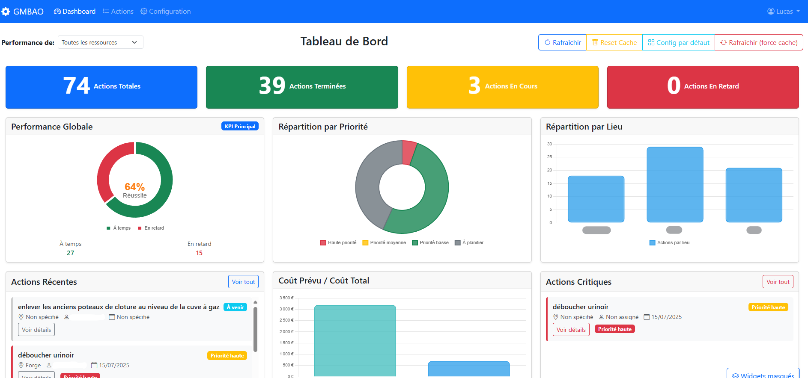

# GMAO - Gestion de Maintenance Assistée par Ordinateur

GMAO est une application web complète conçue pour la gestion et le suivi des actions de maintenance industrielle. Elle offre une interface intuitive et des outils puissants pour planifier, suivre et documenter toutes les interventions.

## Fonctionnalités principales

-   **Interface de type Excel** : Gestion fluide et rapide des actions de maintenance.
-   **Tableau de Bord Dynamique** : Visualisez en temps réel les statistiques clés, les alertes et les performances.
-   **Gestion des Utilisateurs** : Contrôle d'accès basé sur les rôles (Admin, Manager, Pilote).
-   **Planification Avancée** : Calcul automatique des dates de fin en fonction des calendriers de travail et des exceptions.
-   **Gestion de Photos** : Attachez des photos avec compression automatique pour chaque action.
-   **Configuration Facile** : Gérez les lieux, les pilotes et les calendriers directement depuis l'interface.

---

## 🚀 Installation et Lancement

L'application est conçue pour un déploiement rapide et simple sur un PC Debian. Pour installer et lancer l'application, suivez les instructions détaillées dans notre guide de déploiement.

**➡️ [Consulter le Guide de Déploiement](DEPLOYMENT_GUIDE.md)**

---

## Structure Technique

-   **Backend** : API robuste construite avec [FastAPI](https://fastapi.tiangolo.com/).
-   **Frontend** : Interface utilisateur réactive sans framework, utilisant du JavaScript moderne.
-   **Base de données** : [SQLite](https://www.sqlite.org/index.html) pour une portabilité maximale.
-   **Dépendances** : L'installation est gérée via un environnement virtuel Python pour un déploiement propre et isolé.

Une fois l'application lancée, la documentation complète de l'API est accessible à [http://localhost:8000/docs](http://localhost:8000/docs).
